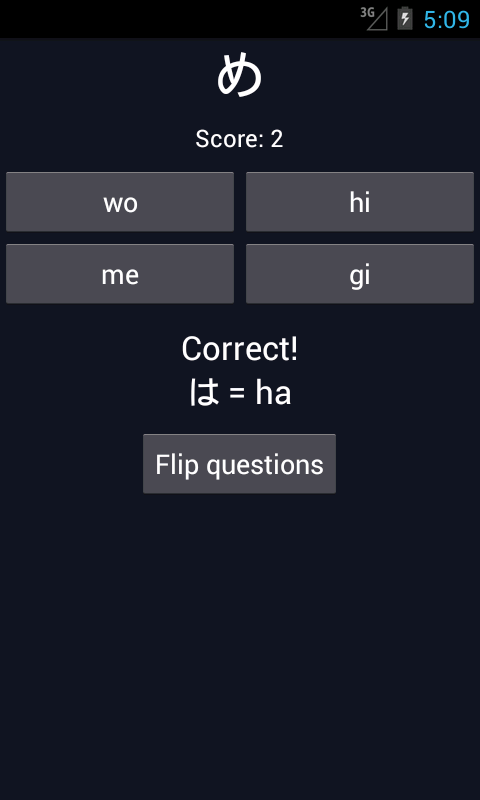
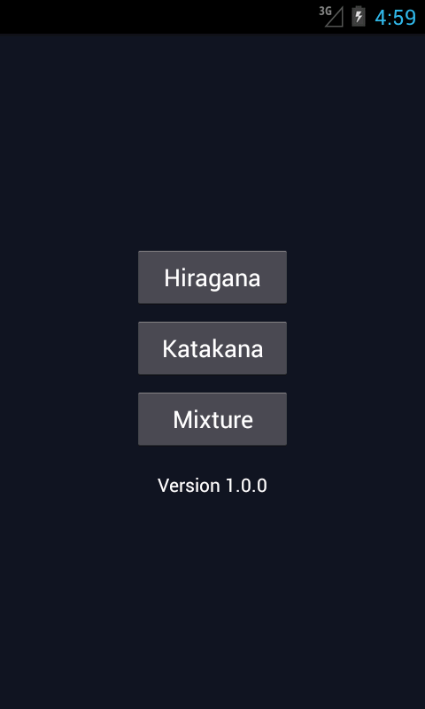

Japanese Characters
========================

What is it?
-----------

Japanese Characters is a simple lightweight Android app for practicing hiragana and katakana. Contains no ads and requires no permissions.

The Latest Version
------------------

- Latest version [on the Play Store](https://play.google.com/store/apps/details?id=com.pikamander2.japanesequiz)

Screenshots
-----------

Contribute!
-----------

Code contributions are welcome!

You should fork the repo as described here: http://help.github.com/fork-a-repo/

License
-------

This program is free software: you can redistribute it and/or modify
it under the terms of the GNU General Public License as published by
the Free Software Foundation, either version 3 of the License, or
(at your option) any later version.

This program is distributed in the hope it will be useful,
but WITHOUT ANY WARRANTY; without even the implied warranty of
MERCHANTABILITY or FITNESS FOR A PARTICULAR PURPOSE. See the
GNU General Public License for more details.

You should have received a copy of the GNU General Public License
along with this program.  If not, see http://www.gnu.org/licenses

Latest Changes
--------------
* switched to Android-Studio
* Add color for error message

Todo
----
* Add Composed Kana   ie:  Gyu  Pyo  Nya etc ...
* Customize number of answer to increase difficulty
* Memorise/Summarise scores after n answers
* Draw Kana instead of picking (unlikely to occur in this app ;-) )

